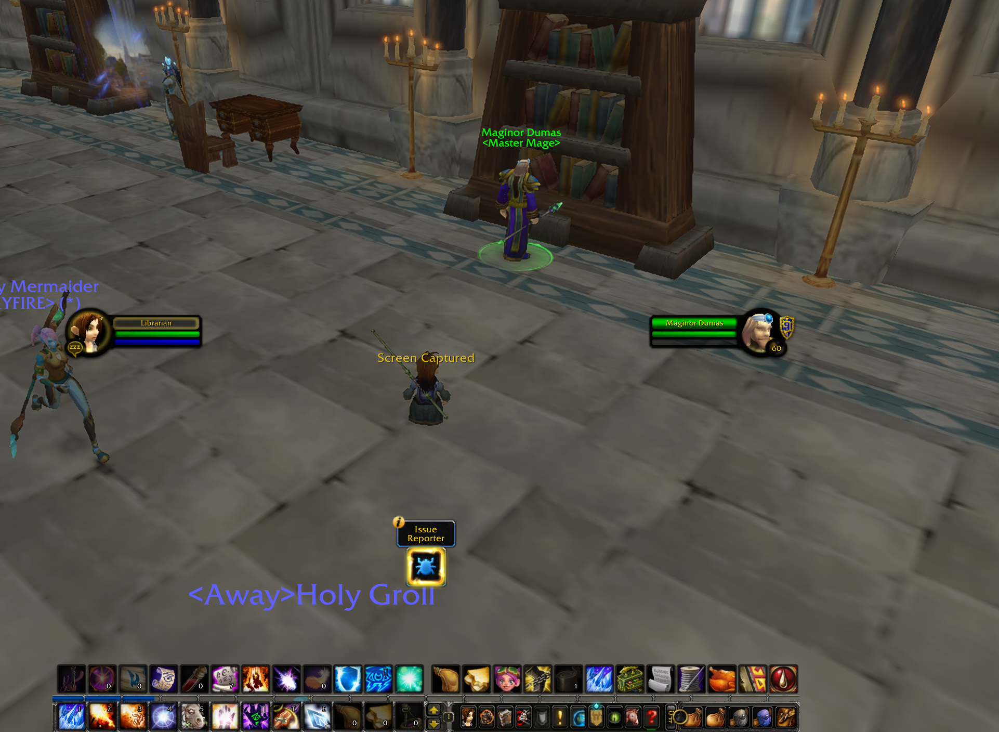

# Lorti UI Forever

An unofficial Lorti UI port for the World of Warcraft: Forever beta.
It adds dark borders, glossy button borders to the native UI.

## Install

Download the release ZIP and extract `LortiUIForever` into `Interface/AddOns`.
Enable **Lorti UI Forever** on the character screen. Disable overlapping UI skins
when checking its appearance.

## Settings

Type `/lorti` for settings and status. Use `/lorti off` or `/lorti on` to toggle
the skin, then `/reload`. Frames, minimap, other windows, bag windows, bag bar buttons, key ring, menu bar, XP bar border, tooltips, action buttons, auras, hotkeys and macro names have
separate switches. See [FOREVER.md](FOREVER.md) for all commands.

## Beta notes

Version **0.1.3-beta** targets interface **16001**. It keeps Forever's native frame
layout and controls. Some protected auras and unsupported windows stay unchanged.
The screenshot shows an in-game example; full combat, raid and taint checks remain
outstanding. Please include the first full error and `/lorti` output in bug reports.

Source and issues: https://github.com/coffeelover1010/lorti-ui-forever

## Credits and license

This is an unofficial port of Lorti UI. It is not an official release by the
original authors, and it is not affiliated with Blizzard Entertainment.

- Original Lorti UI: **Lorti / lortipwnz** — https://www.curseforge.com/wow/addons/lorti_ui
- Classic adaptation: **Chordsy and the upstream contributors**.
- Source used: https://github.com/EzioAu/Lorti-UI-Classic
- Upstream revision: `7e0cf9162b6752adf20ead39d2ce0f992ed7b61b` (Classic 1.1.0).
- Forever adaptation and maintenance: **Videocat / coffeelover1010**.

Released under the **GNU General Public License version 3 (GPLv3)**. See
[LICENSE](LICENSE) and [NOTICE.md](NOTICE.md). The original project's license is
published at https://www.curseforge.com/wow/addons/lorti_ui/license.
The upstream snapshot omitted a license file; this distribution includes it.
Original code and artwork remain credited to their respective authors.
