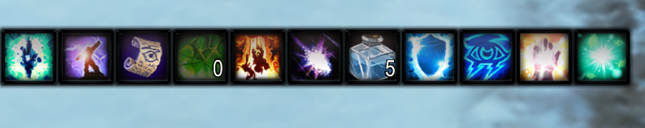

# Lorti UI Forever

- Dark borders and glossy buttons for WoW Forever.
- Supports Blizzard action buttons and Bartender4 action and pet buttons.
- Styles supported unit frames, minimap borders and buff icons.
- Separate options for windows, bags, tooltips and more.
- Open **Settings > AddOns > Lorti UI Forever**, then `/reload` after changes.
- Bartender keeps its own text settings. Masque takes priority for button skins.
- Beta: some frames are not supported; full combat and taint testing is ongoing.

Install the [latest release](https://github.com/coffeelover1010/lorti-ui-forever/releases) in `Interface/AddOns/LortiUIForever`.

[Commands](FOREVER.md) · [Compatibility](docs/CLASSIC-PARITY.md) · [Report a bug](https://github.com/coffeelover1010/lorti-ui-forever/issues)

Unofficial port by Videocat. Original Lorti UI by Lorti / lortipwnz; Classic adaptation by Chordsy and [upstream contributors](https://github.com/EzioAu/Lorti-UI-Classic). [GPLv3](LICENSE) · [Full credits](NOTICE.md).
